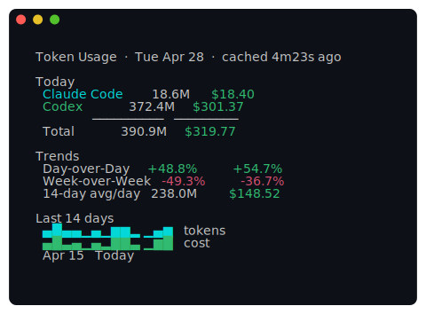
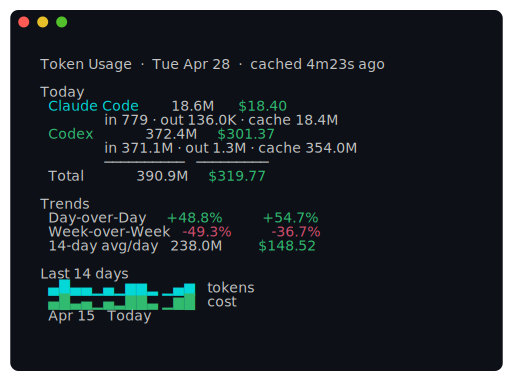
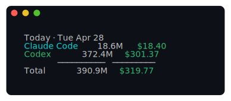
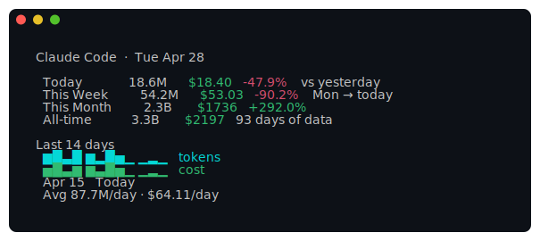
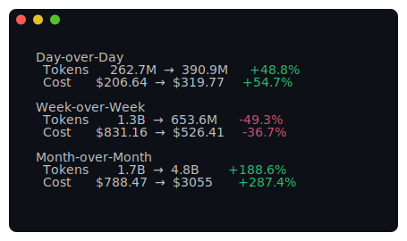
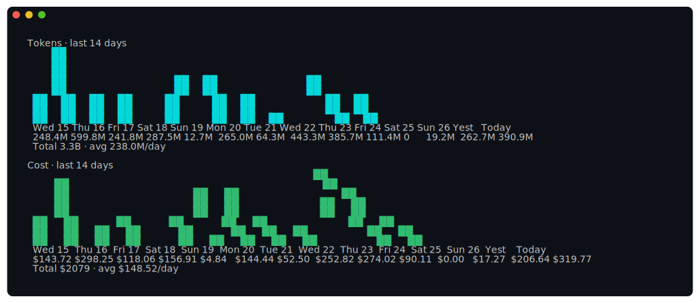

<div align="center">

# 🪙 tokens

**AI token usage stats in your terminal.**

*Claude Code + Codex daily spend, trends, and growth — one command.*

</div>

You want to know how much you're burning on Claude Code and Codex without leaving the terminal. `tokens` shells out to [`ccusage`](https://github.com/ryoppippi/ccusage) and [`@ccusage/codex`](https://www.npmjs.com/package/@ccusage/codex), caches the result, and renders a one-screen dashboard with sparklines and growth metrics.

- 📊 **One-screen dashboard** — today's spend per tool, trends, sparklines, all above the fold
- 💸 **Cost first** — every view shows tokens *and* dollars
- 📈 **Growth at a glance** — day-over-day, week-over-week, month-over-month
- ⚡ **Cached by default** — npx is slow; cached reads are ~50ms
- 🔍 **Detailed mode** — `-d` adds input/output/cache breakdown
- 🔧 **JSON output** — every view supports `--json` for piping

---

<div align="center">



</div>

## Install

Requires [Go 1.25+](https://go.dev/dl/) and [Node.js](https://nodejs.org/) (for `npx`). On first run, `npx` will fetch `ccusage` and `@ccusage/codex` automatically.

```sh
git clone https://github.com/shadowfax92/tokens.git
cd tokens
make install
```

This builds and copies `tokens` to `$GOPATH/bin/`.

## Quick Start

```sh
tokens                  # one-screen dashboard
tokens today            # just today's numbers
tokens today --days 5   # compact daily totals for the last 5 days
tokens claude           # Claude Code deep dive
tokens chart --days 30  # full bar charts
tokens growth --days 14 # last 14 days vs previous 14 days
```

## Commands

| Command | Description |
|---------|-------------|
| `tokens` | Default dashboard — today, trends, sparklines |
| `tokens today` | Today only, compact and pipe-friendly; add `--days N` for a daily window |
| `tokens claude` (`cc`) | Claude Code: today, week, month, all-time, sparkline |
| `tokens codex` (`cx`) | Codex: same shape |
| `tokens chart` | Full-size daily bar charts for tokens and cost; add `-d` for token breakdowns |
| `tokens growth` | Day/week/month deltas, or `--days N` to compare a rolling window |
| `tokens raw` (`table`) | Tabular daily breakdown — pipeable to `awk`, `column`, etc. |
| `tokens refresh` | Bust the cache and re-fetch |
| `tokens config` | Open config in `$EDITOR` |

### Global flags

| Flag | Default | Description |
|------|---------|-------------|
| `--days N` | `14` | Window for charts, raw tables, sparklines, and explicit daily/growth views |
| `-d, --detailed` | `false` | Show input/output/cache breakdown where the view supports totals |
| `--no-cache` | `false` | Bypass cache, force re-fetch |
| `--json` | `false` | JSON output |

## Detailed mode

Add `-d` to surface the input / output / cache split alongside totals. Dashboards and tool views show per-tool detail; chart and growth views show window-level breakdowns:

<div align="center">



</div>

## Today only

Compact, scriptable output — pipe it into anything. Add `--days N` to show one compact daily block per day:

<div align="center">



</div>

## Per-tool deep dive

`tokens claude` (alias `cc`) and `tokens codex` (alias `cx`) zoom in on a single tool with this-week / this-month / all-time, plus a sparkline:

<div align="center">



</div>

## Growth

`tokens growth` answers "am I trending up or down?" By default it shows day/week/month deltas. With `--days N`, it compares the last `N` days against the previous `N` days:

<div align="center">



</div>

## Full charts

`tokens chart` opens up the sparklines into full vertical bar charts. Use `--days 30` for a longer window, and `-d` to add per-day input/output/cache rows:

<div align="center">



</div>

## Config

Location: `~/.config/tokens/config.yaml` (or `$XDG_CONFIG_HOME/tokens/config.yaml`)

```yaml
default_days: 14        # default window for charts
cache_ttl_minutes: 5    # how long to trust cached data before re-fetching
```

The cache lives at `~/.cache/tokens/cache.json`. Print either path with:

```sh
tokens config --path        # config file path
tokens config --cache-path  # cache file path
```

## Shell completions

```sh
make completions    # installs fish completions to ~/.config/fish/completions/
```

---

<div align="center">

> Personal tool I built for my own workflow. Feel free to fork and adapt.

</div>
